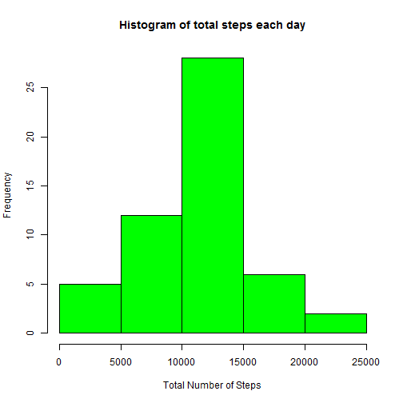
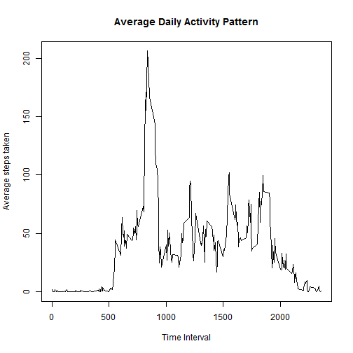
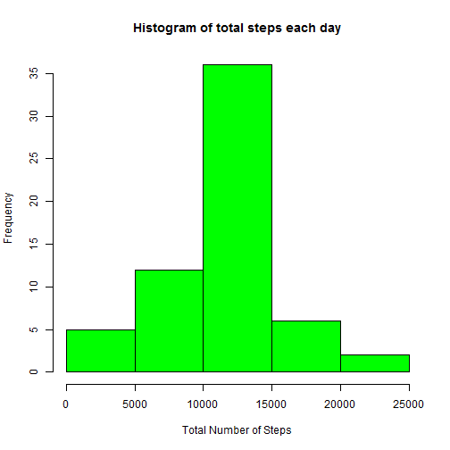

PA1_template.Rmd
==================================

##Loading and preprocessing the data


```r
oridata<-read.csv("activity.csv")
oridata$date<-as.character(oridata$date)
oridata$date<-as.Date(oridata$date)
str(oridata)
```

```
## 'data.frame':	17568 obs. of  3 variables:
##  $ steps   : int  NA NA NA NA NA NA NA NA NA NA ...
##  $ date    : Date, format: "2012-10-01" "2012-10-01" ...
##  $ interval: int  0 5 10 15 20 25 30 35 40 45 ...
```

Now we have a dataframe of the dataset with appropriate type for the analysis.

##What is mean total of steps taken per day?

1. We first make a histogram of the total number of steps taken each day.


```r
data<-na.omit(oridata) #totally remove all cases whith NA
combine<-aggregate(data$steps,by=list(data$date),FUN=sum,na.rm=TRUE)
names(combine)<-c("date","total_steps")
head(combine)
```

```
##         date total_steps
## 1 2012-10-02         126
## 2 2012-10-03       11352
## 3 2012-10-04       12116
## 4 2012-10-05       13294
## 5 2012-10-06       15420
## 6 2012-10-07       11015
```

```r
hist(combine$total_steps,col="green",xlab="Total Number of Steps",ylab="Frequency",main="Histogram of total steps each day")
```

 

2. Now we calculate the mean and median of total number of steps taken per day.


```r
mean<-mean(combine$total_steps,na.rm=TRUE)
median<-median(combine$total_steps,na.rm=TRUE)
```

The mean is 1.0766189 &times; 10<sup>4</sup>.
The median is 10765.

##What is the average daily activity pattern?


```r
combine2<-aggregate(data$steps,by=list(data$interval),FUN=mean,na.rm=TRUE)
names(combine2)<-c("interval","average_steps")
head(combine2)
```

```
##   interval average_steps
## 1        0     1.7169811
## 2        5     0.3396226
## 3       10     0.1320755
## 4       15     0.1509434
## 5       20     0.0754717
## 6       25     2.0943396
```

```r
plot(combine2$interval,combine2$average_steps,type="l",main="Average Daily Activity Pattern",xlab="Time Interval",ylab="Average steps taken")
```

 

```r
maxtime<-combine2$interval[combine2$average_steps==max(combine2$average_steps)]
print(maxtime)
```

```
## [1] 835
```

Hence, the time interval which has maximum average number of steps is 835.  
Note: time interval in the format of *hmm* or *hhmm* in 24hrs time format.

##Inputing missing values
1. Calculate and report the total number of missing value.

```r
sum_na<-sum(is.na(oridata$steps))
print(sum_na)
```

```
## [1] 2304
```
Total missing value is 2304.

2. Filling the missing values with mean of that 5 minute interval, i.e. using values from previous step.

```r
data2<-oridata
retrieve_time<-data2$interval[is.na(data2$steps)]
rtimedf<-data.frame(index=1:length(retrieve_time),interval=retrieve_time)
rmergedf<-merge(rtimedf,combine2)
rmergedf<-rmergedf[order(rmergedf$index),]
data2$steps[is.na(data2$steps)]<-rmergedf$average_steps
sum(is.na(data2$steps))
```

```
## [1] 0
```

```r
head(data2)
```

```
##       steps       date interval
## 1 1.7169811 2012-10-01        0
## 2 0.3396226 2012-10-01        5
## 3 0.1320755 2012-10-01       10
## 4 0.1509434 2012-10-01       15
## 5 0.0754717 2012-10-01       20
## 6 2.0943396 2012-10-01       25
```
3. Now we have a new dataset with missing values filled in.
4. Create a histogram of the total number of steps taken each day.

```r
combine3<-aggregate(data2$steps,by=list(data2$date),FUN=sum)
names(combine3)<-c("date","total_steps")
head(combine3)
```

```
##         date total_steps
## 1 2012-10-01    10766.19
## 2 2012-10-02      126.00
## 3 2012-10-03    11352.00
## 4 2012-10-04    12116.00
## 5 2012-10-05    13294.00
## 6 2012-10-06    15420.00
```

```r
hist(combine3$total_steps,col="green",xlab="Total Number of Steps",ylab="Frequency",main="Histogram of total steps each day")
```

 

Now we calculate the mean and median of total number of steps taken per day.


```r
mean2<-mean(combine3$total_steps)
median2<-median(combine3$total_steps)
```

The mean is 1.0766189 &times; 10<sup>4</sup>. 
The median is 1.0766189 &times; 10<sup>4</sup>.

So compares the above two values with the previous values.
Old mean = 1.0766189 &times; 10<sup>4</sup>. New mean = 1.0766189 &times; 10<sup>4</sup>.  
Old median = 10765. New median = 1.0766189 &times; 10<sup>4</sup>.  
We can see there are only slight difference in these values. Hence, the impact of inputing missing values is very small.

##Are there differences in activity patterns between weekdays and weekends?

We will use the new data set (with filled missing value).

1. Create a new factor variable.

```r
data2<-cbind(data2,weekdays(data2$date))
names(data2)[4]<-"day"
levels(data2$day)<-c("weekday","weekday","weekend","weekend","weekday","weekday","weekday")
table(data2$day)
```

```
## 
## weekday weekend 
##   12960    4608
```

```r
head(data2)
```

```
##       steps       date interval     day
## 1 1.7169811 2012-10-01        0 weekday
## 2 0.3396226 2012-10-01        5 weekday
## 3 0.1320755 2012-10-01       10 weekday
## 4 0.1509434 2012-10-01       15 weekday
## 5 0.0754717 2012-10-01       20 weekday
## 6 2.0943396 2012-10-01       25 weekday
```
2. Make a panel plot.

```r
library(lattice)
combine4<-aggregate(data2$steps,by=list(data2$interval,data2$day),FUN=mean)
names(combine4)<-c("interval","day","average_steps")
head(combine4)
```

```
##   interval     day average_steps
## 1        0 weekday    2.25115304
## 2        5 weekday    0.44528302
## 3       10 weekday    0.17316562
## 4       15 weekday    0.19790356
## 5       20 weekday    0.09895178
## 6       25 weekday    1.59035639
```

```r
xyplot(combine4$average_steps ~ combine4$interval | combine4$day,layout=c(1,2), type="l",xlab="Interval",ylab="Average number of steps")
```

 

From the plot, we can see that there are differences on daily activities between weekends and weekdays. During weekend, the person is more active and the active period and intensity is more constant compared to during weekdays.
